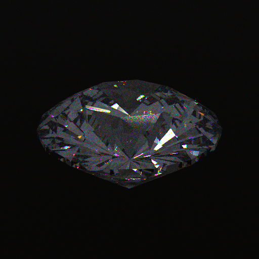

# Spectral diamond raytracer

A physically based, spectral path tracer for a round-brilliant cut diamond,
written in vectorised NumPy. It reproduces **fire** — the flashes of spectral
colour a real diamond throws — by tracing one wavelength per ray through a
dispersive medium and integrating the results back to RGB.



```
pip install numpy pillow      # ffmpeg also needed for --anim
python spectral_diamond.py --preview
```

## The algorithm

The renderer is a Monte-Carlo path tracer. Each pixel is estimated by averaging
`--spp` independent light paths; every path carries a **single wavelength**, so
dispersion falls out naturally instead of being faked with three fixed RGB
refraction indices.

1. **Geometry.** A 57-facet brilliant is built analytically from real cut
   proportions ([`build_gem`](spectral_diamond.py#L104)) — table, star, bezel,
   girdle, and pavilion facets as a triangle soup. Per-triangle normals are
   pre-computed and flipped to face outward.

2. **Camera.** An orbit camera is placed from `--azimuth`, `--elevation`, and
   `--distance`, looking at the stone with a `--fov` field of view. Rays are
   generated per pixel with random sub-pixel jitter each sample, giving free
   anti-aliasing.

3. **Wavelength sampling.** Each ray draws a wavelength λ uniformly in
   380–730 nm. The glass index at that λ comes from the **Cauchy relation**
   fitted to diamond's catalogue refractive index (n_d = 2.417) and Abbe number
   (55). `--fire` exaggerates the dispersive term while pinning the reference
   index, so you can push the effect past physical without changing the stone's
   overall brightness.

4. **Ray/gem intersection** ([`hit_gem`](spectral_diamond.py#L153)). A
   bounding-sphere test rejects most rays first; survivors are tested against
   all triangles at once with a vectorised Möller–Trumbore intersection, keeping
   the nearest hit.

5. **Surface interaction.** At each hit the exact **unpolarised Fresnel**
   equations give the reflect/refract split, and **total internal reflection**
   is handled deterministically (diamond's high index means light bounces around
   inside many times before escaping — this is what creates the fire). A random
   number chooses reflection vs. transmission weighted by the Fresnel
   reflectance. Refraction uses Snell's law at the sampled wavelength.

6. **Bouncing.** Rays refracted into the stone are followed for up to
   `--bounces` internal reflections. Any ray that exits — or misses the gem —
   samples the **environment** ([`env`](spectral_diamond.py#L199)): a
   sky/ground gradient plus up to five small, bright studio lights. Small
   sources are deliberate; a broad soft light would wash the dispersion fan back
   into white.

7. **Spectral → RGB.** The environment radiance sampled by a monochromatic ray
   is converted back through a smooth partition-of-unity spectrum, then weighted
   by the **CIE 1931 colour-matching functions** (Wyman–Sloan–Shirley Gaussian
   fits) and the sRGB matrix. A white-normalisation constant guarantees a flat
   spectrum renders as neutral (1,1,1) rather than green.

8. **Output.** Accumulated linear radiance is tone-mapped with the ACES
   filmic curve at `--exposure`, gamma-corrected, and written as a PNG. Rays are
   processed in batches of `--chunk` to bound memory; work is fully vectorised
   across the batch.

## Usage

```
python spectral_diamond.py [options]
```

### Common presets

```
python spectral_diamond.py                          # 512px, 48spp
python spectral_diamond.py -w 800 -s 200 -o gem.png # slow, clean
python spectral_diamond.py --fire 3 --azimuth 35    # exaggerated dispersion
python spectral_diamond.py --preview                # 192px, 12spp, ~5s
python spectral_diamond.py --ambient 0 --lights 1   # black void, max colour
python spectral_diamond.py --top                    # straight-down table view
python spectral_diamond.py --anim spin.mp4          # 60-frame rotation (ffmpeg)
```

### Arguments

| Flag             | Default       | Description                                                                              |
| ---------------- | ------------- | ---------------------------------------------------------------------------------------- |
| `-w, --width`    | `512`         | Image size in pixels (output is square, W×W).                                            |
| `-s, --spp`      | `48`          | Samples per pixel — one wavelength each. Higher = less noise, linearly slower.           |
| `-b, --bounces`  | `8`           | Max internal reflections traced inside the stone.                                        |
| `-o, --out`      | `diamond.png` | Output image path.                                                                       |
| `-e, --exposure` | `0.60`        | Tone-map exposure.                                                                       |
| `--seed`         | `7`           | RNG seed, for reproducible renders.                                                      |
| `--fire`         | `1.0`         | Dispersion multiplier; `1.0` is physical diamond, higher exaggerates the colour.         |
| `--azimuth`      | `0.0`         | Camera orbit angle around the stone (degrees).                                           |
| `--elevation`    | `26.0`        | Camera height angle (degrees).                                                           |
| `--distance`     | `2.33`        | Camera distance from the stone.                                                          |
| `--fov`          | `34.0`        | Field of view (degrees).                                                                 |
| `--ambient`      | `0.25`        | Sky/ground fill level; `0` = pure black void (max colour, but the stone loses its form). |
| `--lights`       | `3`           | How many of the 5 studio lights to use (1–5).                                            |
| `--chunk`        | `24000`       | Rays per batch; lower it if you run out of memory.                                       |
| `--hdr FILE`     | —             | Also save the raw linear radiance as a `.npy` (re-tone-map later without re-rendering).  |
| `--preview`      | off           | Fast preview: forces 192px / 12spp.                                                      |
| `--top`          | off           | Top-down view: forces `--elevation 90`, looking straight down the table.                 |
| `--anim OUT.mp4` | —             | Render a rotation animation to this `.mp4` (requires `ffmpeg` on PATH).                  |
| `--anim-frames`  | `60`          | Number of frames for `--anim`.                                                           |
| `--anim-step`    | `0.1`         | Azimuth increment per frame, in degrees.                                                 |
| `--fps`          | `30`          | Frame rate of the `--anim` output.                                                       |

### Animation

`--anim` renders `--anim-frames` frames, rotating the camera `--anim-step`
degrees in azimuth between each, then stitches them into an H.264 `.mp4` with
ffmpeg. Progress is reported per frame and per sample:

```
frame 3/60 completed  40%  (  12.4s)
```

Note the defaults (60 frames × 0.1°) sweep only **6°** — a subtle wobble. For a
full turn use e.g. `--anim spin.mp4 --anim-frames 360 --anim-step 1`. Every
frame is a full render, so total time is roughly `frames × single-image time`;
combine with `--preview` or a low `-s` while dialling in the motion.

### Lighting note

`--ambient` trades colour saturation against readability. Measured at
224px/24spp, 3 lights:

| ambient | mean saturation | fraction of frame lit |
| ------- | --------------- | --------------------- |
| 1.00    | 0.454           | 0.215                 |
| 0.50    | 0.482           | 0.204                 |
| 0.25    | 0.496           | 0.183 (default)       |
| 0.12    | 0.498           | 0.115                 |
| 0.05    | 0.600           | 0.022                 |

Saturation keeps climbing as the fill drops, but below ~0.25 the lit area falls
off a cliff and the stone stops reading as a solid object.
