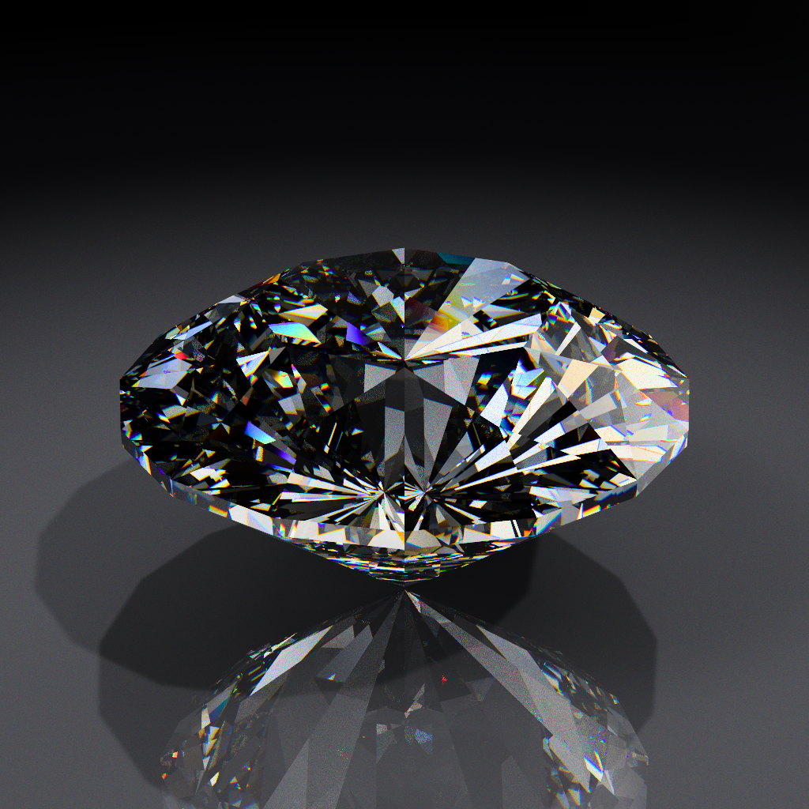

# Spectral diamond raytracer

A physically based, spectral path tracer for a round-brilliant cut diamond. It
reproduces **fire** — the flashes of spectral colour a real diamond throws — by
tracing one wavelength per ray through a dispersive medium and integrating the
results back to RGB.



```
pip install numpy pillow wgpu   # ffmpeg also needed for --anim
python gpu/diamond.py --preview
```

## Two renderers

The same physics is implemented twice, and the two are checked against each
other.

|                | `gpu/diamond.py`                        | `cpu/diamond.py`             |
| -------------- | --------------------------------------- | ---------------------------- |
| implementation | WGSL compute kernel, one thread per ray | vectorised NumPy             |
| 720px, 2048spp | ~10 s                                   | ~90 min                      |
| needs          | `wgpu` + any Vulkan/DX12/Metal GPU      | numpy only                   |
| studio floor   | yes                                     | no                           |
| cast shadows   | yes                                     | no                           |
| display grade  | full chain, wide-gamut working space    | legacy per-channel ACES only |
| use it for     | everything                              | checking the GPU is honest   |

```
python gpu/diamond.py [options]      # the one you want
python cpu/diamond.py [options]      # reference implementation, ~40x slower
python gpu/stripe.py  [options]      # spectrum swatch tool
```

They take deliberately similar flags, so it is easy to launch the wrong one and
wonder why 16 cores are pegged while the GPU sits idle. The header line tells
you which is running — the GPU names its adapter, the CPU prints `jobs N`:

```
NVIDIA GeForce RTX 3060 (Vulkan) | 110 triangles | 512x512 | 128 spp | ...
110 triangles | 512x512 | 48 spp | ... | rig studio (3 lights) | jobs 16
```

`gpu/` imports the physics from `cpu/`, so there is exactly one definition of
the geometry, the CIE weights and the lighting rigs. `--compare` renders the
same frame on both backends and reports whether they agree within sampling
noise — that comparison is why the CPU version still exists.

## Layout

```
gpu/    the renderer you want
  diamond.py    command line
  kernel.wgsl   the compute kernel itself
  renderer.py   device, pipeline, uniform packing
  colour.py     working colour spaces (sRGB / Rec.2020)
  grading.py    the display grade from spectral_grading_spec.md
  selftest.py   the spec's verification suite, and CPU/GPU agreement
  stripe.py     spectrum swatch tool (+ stripe.wgsl)
cpu/    the reference implementation, and the physics both versions share
  diamond.py    command line
  geometry.py   the 57-facet brilliant, its spin, ray/mesh intersection
  spectrum.py   CIE fit, sRGB matrix, white normalisation
  optics.py     Cauchy dispersion, Fresnel, refraction
  lighting.py   rigs, ambient fill, environment
  trace.py      the path tracer and its process pool
  imaging.py    tone curve, atomic file writes, progress lines
rendered/   all output .png and .mp4 land here
```

`set_spin()` rebinds the geometry arrays and `apply_scene()` rebinds the
lighting ones, so cross-module reads go through the module (`geometry.NRM`),
never `from geometry import NRM` — that would capture a stale array and quietly
render an unspun gem.

## The algorithm

A Monte-Carlo path tracer. Each pixel averages `--spp` independent light paths,
and every path carries a **single wavelength**, so dispersion falls out
naturally instead of being faked with three fixed RGB refraction indices.

1. **Geometry.** A 57-facet brilliant built analytically from real cut
   proportions ([`build_gem`](cpu/geometry.py#L11)) — table, star, bezel,
   girdle and pavilion facets as a triangle soup, with outward-facing normals
   pre-computed. The proportions work out to a 53% table, 32.0° crown angle,
   39.7° pavilion angle and 59.2% total depth.

2. **Camera.** An orbit camera from `--azimuth`, `--elevation` and
   `--distance`, with `--fov`. Rays get random sub-pixel jitter each sample,
   giving free anti-aliasing.

3. **Wavelength sampling.** Each ray draws λ uniformly in 380–730 nm. The index
   at that λ comes from the **Cauchy relation** fitted to diamond's catalogue
   index (n_d = 2.417) and Abbe number (55). `--fire` exaggerates the dispersive
   term while pinning the reference index, so you can push past physical without
   changing the stone's overall brightness.

4. **Ray/gem intersection** ([`hit_gem`](cpu/geometry.py#L95)). A
   bounding-sphere test rejects most rays; survivors get Möller–Trumbore against
   every triangle. The mesh is small enough that this beats an acceleration
   structure — on the GPU all 110 triangles stay in registers.

5. **Surface interaction.** Exact **unpolarised Fresnel** gives the
   reflect/refract split, and **total internal reflection** is deterministic.
   Diamond's high index means light bounces around many times inside before
   escaping, which is what creates the fire.

6. **Bouncing.** Refracted rays are followed for up to `--bounces` internal
   reflections. Any ray that exits — or misses — samples the **environment**
   ([`env`](cpu/lighting.py#L105)): a sky/ground gradient plus up to five
   studio lights, and on the GPU the floor if one is in the way.

7. **Spectral → RGB.** The radiance a monochromatic ray samples is converted
   through a smooth partition-of-unity spectrum, weighted by the **CIE 1931
   colour-matching functions** (Wyman–Sloan–Shirley Gaussian fits) and the
   XYZ→RGB matrix of the working space. A white-normalisation constant
   guarantees a flat spectrum renders neutral rather than green.

8. **Display grade.** Accumulated linear radiance goes through the chain in
   [`spectral_grading_spec.md`](spectral_grading_spec.md), described below. The
   CPU version stops at a per-channel ACES curve.

## Usage

### Common presets

```
python gpu/diamond.py                            # 512px, 128spp, seconds
python gpu/diamond.py --rig showcase --floor     # product shot
python gpu/diamond.py --rig fire -s 2048         # maximum colour
python gpu/diamond.py --floor sweep --shadow     # cast shadow on a lit backdrop
python gpu/diamond.py --floor rings --top        # refraction through a pattern
python gpu/diamond.py --fire 3 --azimuth 35      # exaggerated dispersion
python gpu/diamond.py --anim rendered/spin.mp4 --anim-step 0.75
python gpu/diamond.py --compare                  # CPU/GPU agreement
python gpu/diamond.py --selftest                 # grading verification suite
```

### Image and camera

| Flag             | GPU default                | CPU default            | Description                                       |
| ---------------- | -------------------------- | ---------------------- | ------------------------------------------------- |
| `-w, --width`    | `512`                      | `512`                  | Image size in pixels; output is square.           |
| `-s, --spp`      | `128`                      | `48`                   | Samples per pixel, one wavelength each.           |
| `-b, --bounces`  | `8`                        | `8`                    | Max internal reflections inside the stone.        |
| `-o, --out`      | `rendered/diamond_gpu.png` | `rendered/diamond.png` | Output image path.                                |
| `-e, --exposure` | `0.60`                     | `0.60`                 | Exposure, applied before the tone curve.          |
| `--seed`         | `7`                        | `7`                    | RNG seed.                                         |
| `--fire`         | `1.0`                      | `1.0`                  | Dispersion multiplier; `1.0` is physical diamond. |
| `--azimuth`      | `0.0`                      | `0.0`                  | Camera orbit angle (degrees).                     |
| `--elevation`    | `26.0`                     | `26.0`                 | Camera height angle (degrees).                    |
| `--distance`     | `2.33`                     | `2.33`                 | Camera distance, in girdle diameters.             |
| `--fov`          | `34.0`                     | `34.0`                 | Field of view (degrees).                          |
| `--preview`      | off                        | off                    | Fast preview: 192px / 12spp.                      |
| `--top`          | off                        | off                    | Straight down at the table (`--elevation 90`).    |
| `--hdr FILE`     | —                          | —                      | Also save raw linear radiance as `.npy`.          |

### Lighting

| Flag        | Default                    | Description                                  |
| ----------- | -------------------------- | -------------------------------------------- |
| `--rig`     | `studio`                   | Lighting rig, see below.                     |
| `--lights`  | the rig's own count        | How many of the rig's 5 lights to use (1–5). |
| `--ambient` | `0.08` (GPU), `0.25` (CPU) | Sky/ground fill; `0` is a pure black void.   |

### Floor and shadows — GPU only

| Flag             | Default  | Description                                                               |
| ---------------- | -------- | ------------------------------------------------------------------------- |
| `--floor [MODE]` | `none`   | `mirror` (bare `--floor`), `sweep`, `checker`, `stripes`, `rings`, `grid`. |
| `--shadow [S]`   | `0`      | Cast a shadow, sampling the area lights. Bare `--shadow` gives `0.7`.     |
| `--floor-y`      | `-0.43`  | Floor height; the default is the culet, so the stone just touches it.     |
| `--floor-scale`  | per-mode | Pattern feature size in gem diameters.                                    |
| `--floor-bright` | per-mode | Backdrop emission; `0` leaves only the reflection.                        |
| `--floor-gloss`  | per-mode | Floor reflectance at normal incidence (Schlick F0).                       |
| `--floor-fade`   | `6.0`    | Radius over which the floor dissolves into the sky.                       |
| `--floor-ao`     | `0.55`   | Contact shadow under the stone; sky occlusion, separate from `--shadow`.  |

The floor is a real plane, not an environment trick: a camera ray reflects off
it with probability equal to its Fresnel term and can then enter the gem, so the
stone's reflection appears in the surface below it. Rays leaving the gem also
land on it, which is what makes the patterned modes worth using — refraction
shears the pattern into the dispersion fan. `mirror` is the black glossy acrylic
gems are actually photographed on.

`--shadow` traces one shadow ray per light per sample, importance-sampling each
source's angular profile, so the penumbra is real: crisp under hard keys, soft
under broad fills. Use a bright floor (`sweep`, `checker`) — on `mirror` the
diffuse term is negligible beside the reflection and the shadow barely shows. A
real diamond does not cast a solid shadow, it redirects light into caustics, so
this is an approximation with a dial rather than physics.

### Display grading — GPU only

| Flag                 | Default   | Description                                                  |
| -------------------- | --------- | ------------------------------------------------------------ |
| `--working-space`    | `rec2020` | Primaries the render accumulates and grades in.              |
| `--tonemap-strength` | `1.0`     | `1` = curve on luminance only; `0` = old per-channel ACES.   |
| `--chroma-boost`     | `1.35`    | Oklab vibrance after the curve; above ~2 looks synthetic.    |
| `--keep-chroma`      | `0.85`    | Gamut fit: `1` sacrifices brightness, `0` sacrifices chroma. |
| `--levels B W G`     | `0 1 1`   | Optional contrast shaping before the OETF.                   |
| `--legacy-grade`     | off       | Restore the pre-spec look exactly (rollback switch).         |

### Animation

| Flag             | Default | Description                                     |
| ---------------- | ------- | ----------------------------------------------- |
| `--anim OUT.mp4` | —       | Render a rotation to this `.mp4` (needs ffmpeg). |
| `--anim-frames`  | `60`    | Number of frames.                                |
| `--anim-step`    | `0.1`   | Degrees the **stone** turns per frame.           |
| `--fps`          | `30`    | Frame rate of the output.                        |

### Performance and diagnostics

| Flag              | Where | Description                                            |
| ----------------- | ----- | ------------------------------------------------------ |
| `--jobs`          | CPU   | Worker processes (default: all cores).                 |
| `--chunk`         | both  | Rays per batch on the CPU; the GPU uses it only for `--compare`. |
| `--pass-spp`      | GPU   | Samples per dispatch; `0` auto-tunes to ~0.35 s/pass.  |
| `--low-power`     | GPU   | Prefer the integrated GPU.                             |
| `--list-adapters` | GPU   | Show available GPU adapters and exit.                  |
| `--compare`       | GPU   | Render small on both backends and report agreement.    |
| `--selftest`      | GPU   | Run the grading spec's verification suite and exit.    |

Startup costs ~2.5 s before the first pixel regardless of settings: 1.0 s of
that is the GPU adapter request, 0.22 s is shader compilation. It does not scale
with `--anim-frames`.

## Lighting rigs

`w` is not an angle. The falloff is `exp(-(1-cos t)/w)` and `1-cos t ≈ t²/2`, so
a source is a Gaussian of **σ = √w** radians. A source wider than the dispersion
fan overlaps its own spectrum back into white, and that is the whole trade.
Measured at 384px/1024spp:

| `--rig`    | sources                     | lit area | fiery area | mean saturation |
| ---------- | --------------------------- | -------- | ---------- | --------------- |
| `softbox`  | 3 broad, σ≈7°               | 10.89%   | 2.72%      | 0.470           |
| `showcase` | 2 hard keys + 3 broad fills | 9.46%    | 2.38%      | 0.500           |
| `fire`     | 2 hard keys + 1 broad fill  | 3.95%    | 1.21%      | 0.544           |
| `studio`   | 5 at σ 1.6–3.5° (default)   | 1.78%    | 0.72%      | 0.633           |

`softbox` is bright and brilliant with little colour; `fire` is dark and
contrasty with the purest flashes; `showcase` mixes hard keys with broad fills
and is the best all-rounder for presentation. Hard keys are ~4× noisier per
sample, so `fire` and `showcase` want more `-s` than `softbox` for the same
cleanliness.

Source size sweeps monotonically between the two behaviours:

| σ               | 0.12° | 0.48° | 0.95° | 1.90° | 3.80° | 7.60° |
| --------------- | ----- | ----- | ----- | ----- | ----- | ----- |
| mean saturation | 0.888 | 0.841 | 0.707 | 0.630 | 0.581 | 0.467 |
| lit area        | 0.10% | 0.48% | 0.98% | 1.93% | 5.22% | 11.3% |

The knee sits near 0.5°, the angular size of the sun — not a coincidence, since
brilliant cuts were developed and judged under sunlight and candle flames. Going
smaller buys almost no extra purity and costs a lot of light and a lot of
samples.

`--ambient` trades saturation against readability the same way. Measured at
224px/24spp, 3 lights:

| ambient | mean saturation | fraction of frame lit |
| ------- | --------------- | --------------------- |
| 1.00    | 0.454           | 0.215                 |
| 0.50    | 0.482           | 0.204                 |
| 0.25    | 0.496           | 0.183                 |
| 0.12    | 0.498           | 0.115                 |
| 0.05    | 0.600           | 0.022                 |

Saturation keeps climbing as the fill drops, but below ~0.25 the lit area falls
off a cliff and the stone stops reading as a solid object.

## Animation

`--anim` renders `--anim-frames` frames and stitches them into an H.264 `.mp4`.
**The stone turns, not the camera** — the lights and floor stay put, so
`--azimuth` is honoured on every frame. This matters: orbiting the camera keeps
each facet's orientation to the lights fixed, so the fire pattern barely moves
and you only change which side you look at. Spinning the stone sweeps every
facet through the light directions, which is what makes the flashes fire, die
and change colour.

600 frames at 1024px, `--rig showcase`, one degree of turn every ten frames:

<video src="rendered/a1024s1024-showcase.mp4" controls loop muted width="512">
</video>

[▶ rendered/a1024s1024-showcase.mp4](rendered/a1024s1024-showcase.mp4) — 1024px,
600 frames, 20 s, 13 MB.

The `<video>` tag plays inline in VS Code's preview and on GitLab. GitHub
strips it from markdown and only autoplays videos it hosts itself, so there the
link above is what works; to get it embedded on github.com, drag the file into
an issue comment and paste the `user-attachments` URL it hands back.

A round brilliant is 8-fold symmetric, so **45° is one full cycle** and an
`--anim-step` of `45/frames` loops seamlessly:

```
python gpu/diamond.py --anim rendered/spin.mp4 --anim-frames 60 --anim-step 0.75
```

The default 0.1°/frame sweeps only 6° over 60 frames, which is nearly frozen.
Progress reports an ETA for the **whole sequence**, not the current frame:

```
frame 7/60 | 512/2048 spp | 02:31 elapsed | eta 12:45
```

Frames accumulate as PNGs in a temp directory and are only consumed by ffmpeg at
the end, so a 600-frame 720px run needs ~540 MB of scratch space.

## Display grading

Dispersion was being computed correctly and then destroyed by the display
transform. Per-channel tone curves desaturate by construction — the largest
channel saturates first while the others catch up — and monochromatic
wavelengths lie outside sRGB, so naive clamping finished the job. Measured on
the brightest 0.5% of pixels, mean saturation went from **0.664** in linear HDR
to **0.148** after per-channel ACES: 78% of the chroma lost, in exactly the
pixels carrying the fire.

The chain in [`spectral_grading_spec.md`](spectral_grading_spec.md) fixes it:
exposure → tone curve on **luminance only** → **Oklab** vibrance → convert to
sRGB → gamut fit that pays in brightness rather than chroma → OETF. Same frame,
same measurement: **0.443**.

Two deviations from the spec as written, both documented in the code:

- **Bloom is not implemented.** The spec expected it to be the largest
  perceptual win. Measured here, above-threshold pixels carry 92% of the frame's
  energy — a brilliant cut is nearly all specular flash — so any useful amount
  smears a third of the image back over the stone as haze, and at high amounts
  the mip chain crawls along facet edges.
- **The working space is Rec.2020 by default**, which was the spec's optional
  follow-up. Every monochromatic wavelength is outside sRGB, so the gamut fit was
  desaturating *every* flash before it reached the display. Rec.2020 keeps 73.2%
  of locus chroma against sRGB's 55.5% and halves the pixels still negative at
  the fit. End to end it is a targeted fix rather than a visible lift — only
  0.4% of pixels change by more than 8/255, because real pixels are broadband
  mixtures that were already in gamut.

`--selftest` runs the spec's verification suite: neutral preservation, Oklab
round trips, the reference pixel, gamut closure fuzzed over [−100, 500], and a
bit-exact rollback identity against the old build.

## The spectrum tool

```
python gpu/stripe.py --compare --range 400 700
```

Writes `rendered/spectrum.png`: every column is one wavelength run through the
grade, at maximum saturation and lightness without clipping. Under each band it
draws the display's gamut corner at the same hue, so you can read off how much
headroom the grade leaves. At maximum the answer is none — the chain already
lands exactly on the corner for every wavelength, because clearing negatives
drives the minimum channel to 0 and dividing by the max sets the maximum to 1.

Outside ~400–700 nm the Wyman CIE fit's tails carry no usable radiance and their
hue is meaningless, so the far violet reads blue and the far red reads
yellow-green. `--range 400 700` trims them.
